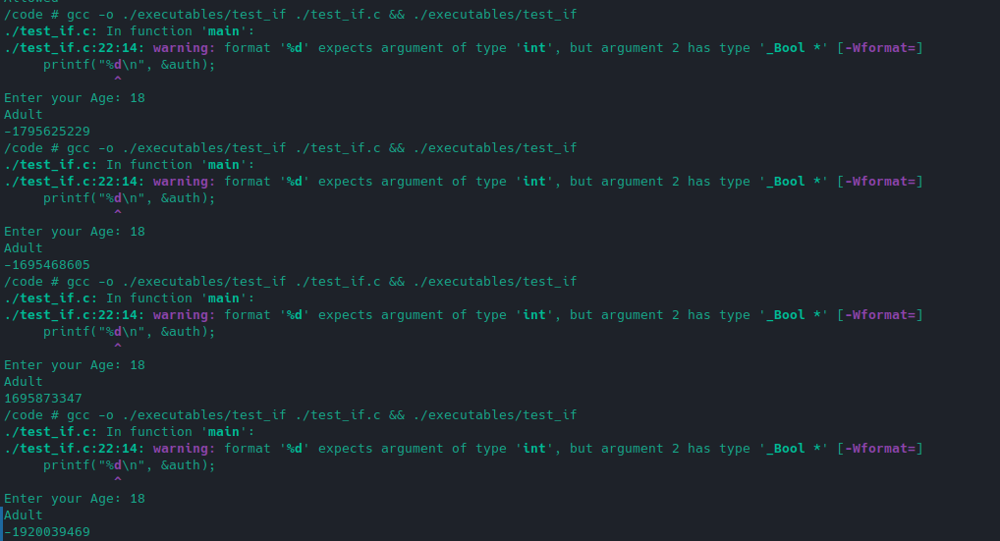
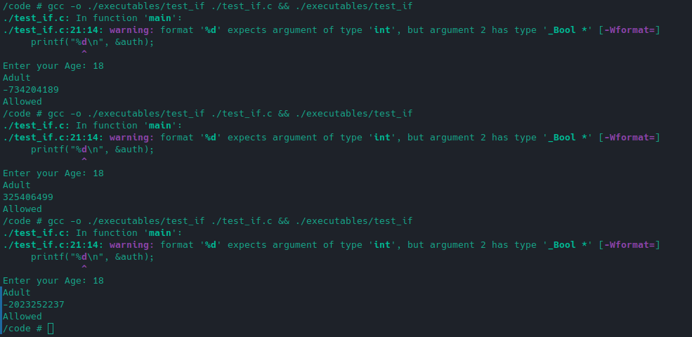

true and false are not keywords in C!!!

you could use this:

```C
#include <stdbool.h>
```

but this also doesn't work as aspected

```C
if (age < 18)
{
    printf("Minor\n");
    auth = false;
}
else
{
    printf("Adult\n");
    auth = true;
}
printf("%s\n", &auth ? "Allowed" : "Not Allowed"); // returns "Allowed everytime"
```

#### Testing:-



As clear from the above code just true bool value keeps on changing. Making it unrealiable.

Another option would be to do something like this:-

```C
typedef int bool;
#define true 1
#define false 0
```

or something more specific to different use cases:-

```C
int isAdult; // Can take the value of 0 or 1
```

> In C, only 0 is considered as false.

This

```C
if(condition);{ //semi-colon after if statements
    // some logic
}
```

breaks the code.
