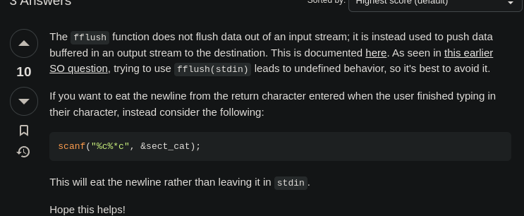

# More Loops

## To Learn

- For loop
- Do-while loop
- break statement
- continue statement

```C
for (;) // Gives an error. 2 semi-colons are required.
```

```C
for(int i =1,j=2; j<=10; j++,i+=2)
```

---

```C
fflush();
```

This function is used to "flush out" whatever data is inside the buffer.<br/>
stdout - for output data buffer<br/>
stdin - input data buffer [DOES NOT WORK]


